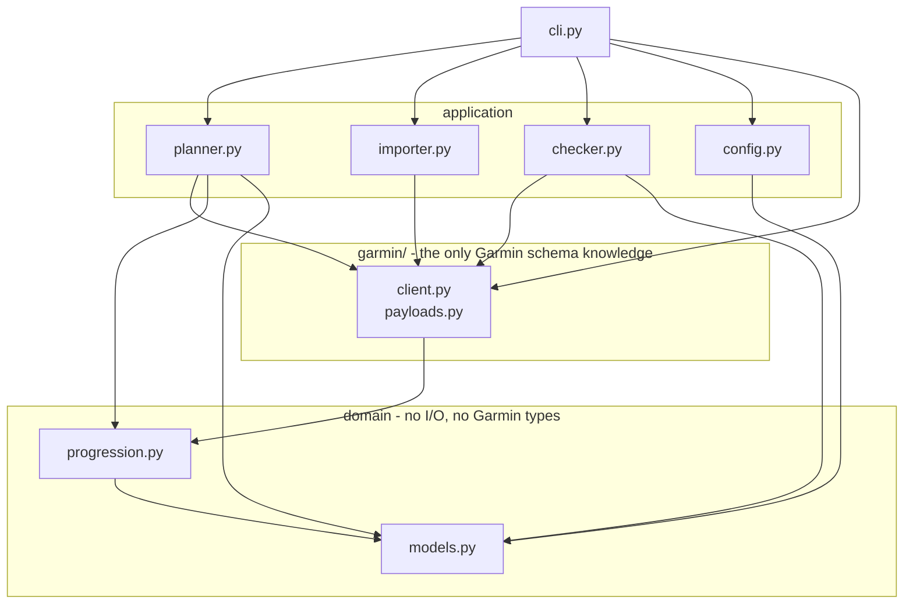
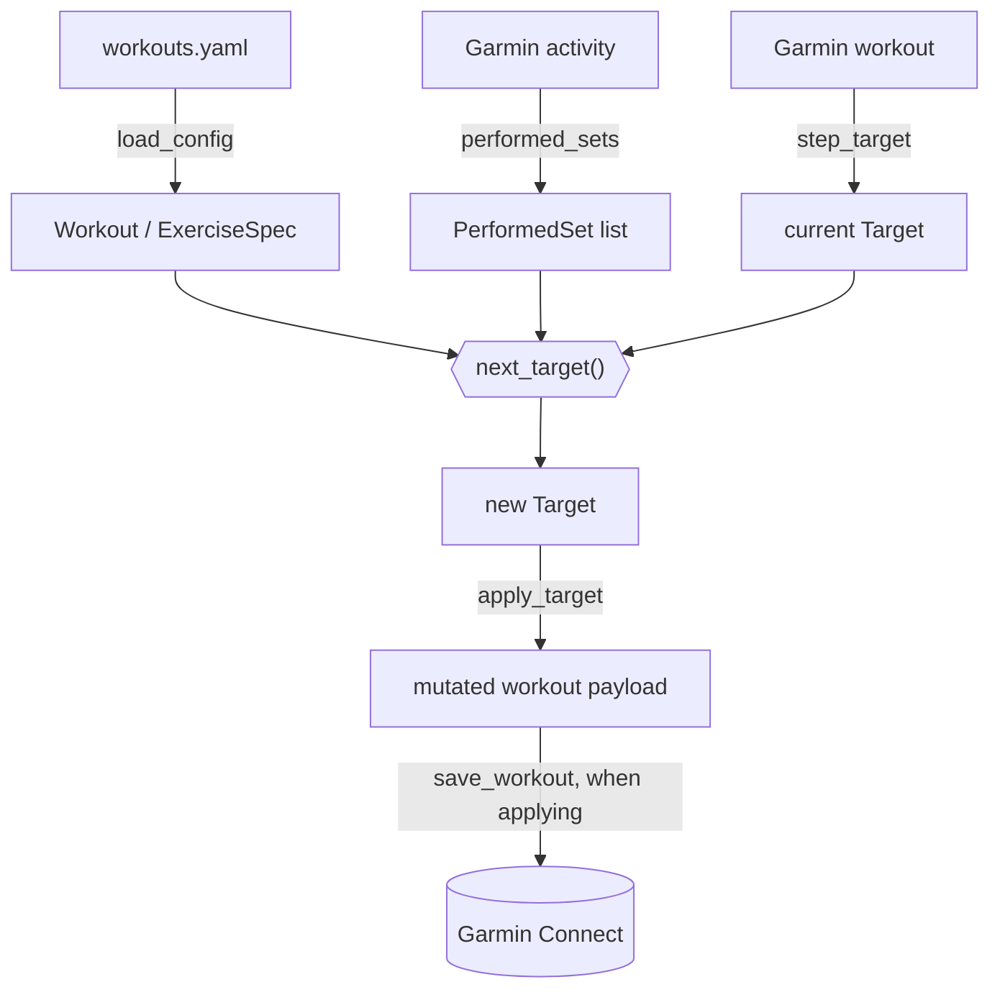

# Architecture

- [Layout](#layout)
- [Dependencies](#dependencies)
- [Data flow](#data-flow)
- [Exercise matching](#exercise-matching)

## Layout

```text
workouts.yaml              all configuration: routine, Garmin ids, settings
workouts.example.yaml      the shipped example, validated by the tests
src/workout/
    models.py              domain objects, no behaviour
    config.py              workouts.yaml -> models, with validation
    progression.py         the rules. No I/O, no Garmin types
    planner.py             match steps to exercises, decide the changes
    importer.py            Garmin workout -> config YAML
    checker.py             compare config against Garmin
    cli.py                 argument parsing and output
    log.py                 which stream a message lands on, and its level
    garmin/
        client.py          authentication and the Garmin session
        payloads.py        Garmin's JSON <-> our types
tests/
    conftest.py            shared builders and fixtures
    test_progression.py    the rules
    test_config.py         loading and validation
    test_payloads.py       schema mapping, using trimmed real payloads
    test_planner.py        matching and planning
    test_importer.py       import and YAML rendering
    test_checker.py        drift detection
    test_cli.py            argument parsing and help
    test_log.py            verbosity, and stdout vs stderr
```

## Dependencies

Every arrow points inward: nothing in `progression.py` or `models.py` imports
the CLI, the planner, or Garmin.



Three boundaries carry the weight:

- **`progression.py` knows nothing about Garmin or YAML.** It takes a spec, a
  current target, and a list of performed sets. That is what makes the rules
  testable without a network.
- **`garmin/payloads.py` is the only module that knows Garmin's schema.** If
  Garmin changes their JSON, everything to fix is in that one file.
- **Only `planner.py` mutates a workout payload, and it performs no I/O.** A
  caller can build a plan and throw it away, which is exactly what a dry run
  does - so a dry run cannot accidentally write.

Everything the application talks to Garmin through is `GarminSession` in
`garmin/client.py`, so the `garminconnect` dependency stays in one place.

`log.py` sits outside those arrows. Modules log through the standard library
and never import it; only `main()` calls `configure()`, which decides what a
level means: INFO is the report and goes to stdout, WARNING and above are
problems and go to stderr, DEBUG is hidden until `--verbose`.

## Data flow



An `update` run in order:

1. Load and validate `workouts.yaml`.
2. Authenticate, reusing cached tokens if present.
3. For every workout, find the latest activity whose name starts with one of
   its `activity_prefixes`. With `--activity`, take just that one instead.
4. Order those sessions oldest first, so replaying them matches what running
   the tool after each would have done.
5. For each in turn, fetch the activity's exercise sets and the Garmin workout
   definition, match every step to an exercise, and compute the next target.
6. Propagate any target that moved into other workouts sharing that exercise.
7. Print the plan. With `--apply`, PUT the mutated workouts back.

A workout definition is fetched at most once per run and mutated in place, so
its own session and a sync from a later one both survive a single write.

## Exercise matching

Names are normalised to letters and digits only, so `BARBELL_BACK_SQUAT` and
`Barbell Back Squat` collapse to the same key.

Lookup order for a workout step:

1. `garmin_name`, normalised
2. `name`, normalised
3. `garmin_category`, but only when exactly one exercise in the workout claims
   that category - otherwise it could not say which one a set belongs to

The same order applies when looking up what was performed, which matters because
Garmin auto-detects exercises while you lift and the name it logs need not match
the one programmed. See [Garmin's API](garmin-api.md#names-drift-between-payloads).

Unmatched exercises are reported as warnings and skipped - never silently
ignored.
