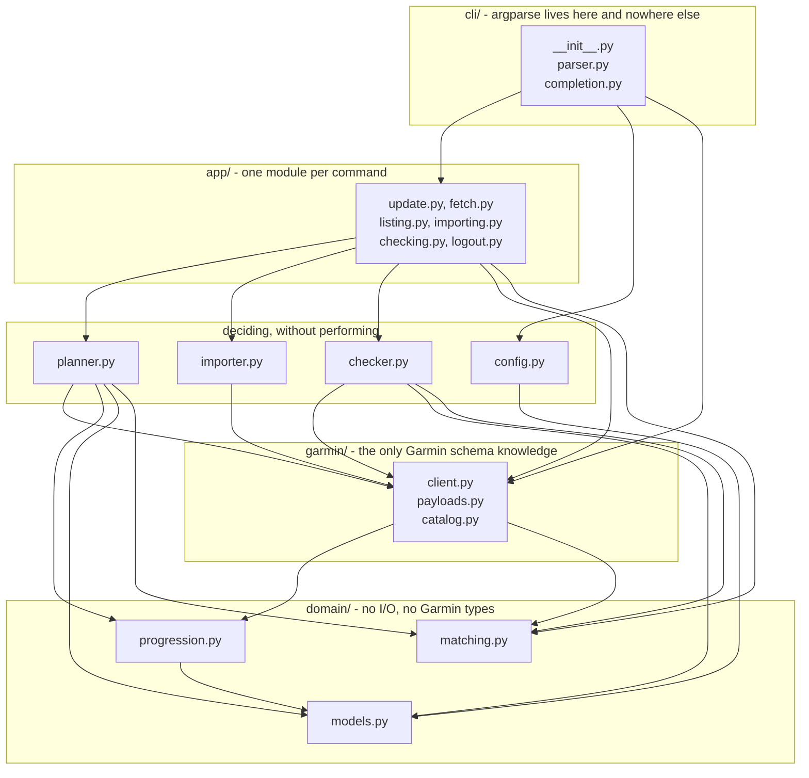
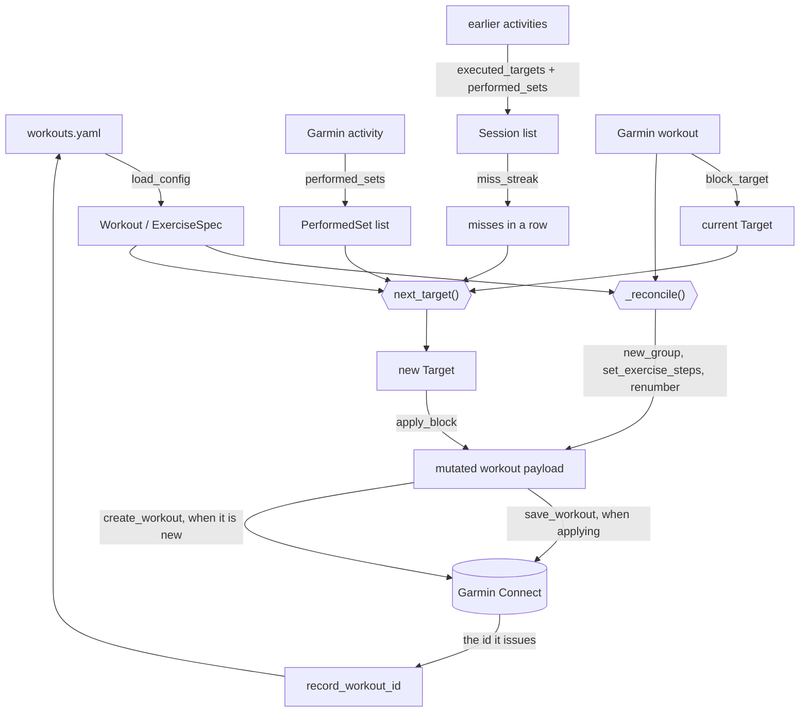

# Architecture

- [Layout](#layout)
- [Dependencies](#dependencies)
- [Data flow](#data-flow)
- [Exercise matching](#exercise-matching)

## Layout

```text
workouts.yaml              all configuration: routine, Garmin ids, settings
workouts.example.yaml      the shipped example, validated by the tests
src/repwise/
    domain/
        models.py          domain objects; a workout knows which activity
                           names are its own
        progression.py     the rules. No I/O, no Garmin types
        matching.py        which exercise a name or category refers to
    app/                   one module per command, plus the report they print
        update.py          advance targets from the sessions trained
        fetch.py           download definitions, sessions, or the catalog
        listing.py         show the account's workouts
        importing.py       Garmin workouts -> config text
        checking.py        config against Garmin
        logout.py          delete the cached tokens
        report.py          how a change, a plan and a finding are printed
    cli/
        parser.py          what the command line accepts, and its help
        completion.py      the same parser, rendered as a shell script
        __init__.py        main(): parse, connect, dispatch, map failures
    config.py              workouts.yaml -> models, with validation, and the
                           one write back to it: an id Garmin has just issued
    planner.py             match steps to exercises, decide the changes
    importer.py            Garmin workout -> config YAML
    checker.py             compare config against Garmin
    errors.py              why a run failed, and what it exits with
    log.py                 which stream a message lands on, and its level
    dumps.py               the dump directory: how it is named, and - with
                           activity_caching on - when a copy of a session may
                           be believed rather than fetched again
    garmin/
        client.py          authentication, the Garmin session, and the cached
                           token: what it is worth and how to be rid of it.
                           Also the session that reads dump_dir first
        payloads.py        Garmin's JSON <-> our types, and building it from
                           nothing for a workout Garmin does not have yet.
                           Also reads the workout an activity was run against
        catalog.py         every exercise Garmin knows, downloaded from a
                           static file and cached in the token store
tests/
    builders.py            the payloads and specs every test builds from
    conftest.py            fixtures
    test_progression.py    the rules, and how far a stall shortens a step
    test_matching.py       name and category lookup
    test_config.py         loading and validation
    test_payloads.py       schema mapping, using trimmed real payloads
    test_planner.py        matching and planning
    test_update.py         session choice, and multi-workout runs
    test_importer.py       import and YAML rendering
    test_checker.py        drift detection
    test_catalog.py        what the catalog says, and how it is cached
    test_checking.py       what `check` gathers before it can check
    test_client.py         the session wrapper, the token store, and the one
                           that reads dump_dir before it asks
    test_dumps.py          the dump layout, and when a copy is believed
    test_fetch.py          what each download writes, and what it skips
    test_logout.py         what signing out deletes, keeps and says
    test_cli.py            argument parsing and help
    test_completion.py     the generated scripts, and what bash makes of them
    test_main.py           dispatch, exit codes, and which stream
    test_log.py            verbosity, and stdout vs stderr
```

`planner.py`, `importer.py` and `checker.py` decide things and return them;
`app/` is what performs a command with those decisions. The split is what lets
`update` be exercised against a fake session in `test_update.py` without an
argument parser anywhere in sight.

## Dependencies

Every arrow points inward: nothing in `progression.py` or `models.py` imports
the CLI, the planner, or Garmin, and nothing in `app/` imports `cli/`.



Four boundaries carry the weight:

- **`cli/` is the only place that constructs anything.** It loads the config,
  opens the Garmin session and turns an argparse namespace into the options a
  use case declares. A `run_*` function is handed what it needs, so the same
  call a command makes is the one a test makes.
- **`domain/` knows nothing about Garmin or YAML.** `progression.py` takes a
  spec, a current target, and a list of performed sets; `matching.py` takes
  names and categories. That is what makes the rules testable without a
  network.
- **`garmin/payloads.py` is the only module that knows Garmin's schema.** If
  Garmin changes their JSON, everything to fix is in that one file. It has two
  halves: reading and editing what Garmin holds, and building the same shapes
  from nothing for a workout it does not. Both only ever write what they are
  told to; whether a change is worth making is the planner's judgement.
- **`garmin/catalog.py` is the exception, and not an API at all.** Garmin's
  list of every exercise it knows is a static file, so it is fetched with the
  standard library rather than through `GarminSession` - which also keeps
  `repwise fetch exercises` from demanding a password to download something
  public. Being a cache, a copy that cannot be read is treated as one that is
  not there, so a truncated file repairs itself on the next run.
- **Only `planner.py` mutates a workout payload, and it performs no I/O.** A
  caller can build a plan and throw it away, which is exactly what a dry run
  does - so a dry run cannot accidentally write.
- **`config.py` is the only module that writes to `workouts.yaml`,** and the
  only thing it ever writes is a workout id Garmin has just issued. It parses
  the document, sets the one key and dumps the whole thing back, so values and
  ordering survive but comments do not.
- **`yamlio.py` is the only module that touches the file at all.** Reading,
  dumping and the atomic replace live there, so `config.py`, `importer.py` and
  the import use case cannot disagree about how the file is parsed, how what we
  write is styled, or how it gets onto disk.

Everything the application talks to Garmin through is `GarminSession` in
`garmin/client.py`, so the `garminconnect` dependency stays in one place. With
[`activity_caching`](configuration.md#reusing-what-is-on-disk) on, `connect()`
builds a `CachedSession` instead, which answers the three per-session reads
from `dump_dir` before it asks. Nothing above it can tell, which is the point:
a use case decides what it needs, not where it comes from.

`dumps.py` sits outside the arrows, like `log.py` and `errors.py` below. Both
`garmin/` and `app/` write dumps, and the layout of that directory is one
statement rather than each of them spelling it - which is what lets the session
read back exactly what `fetch` wrote.

`log.py` sits outside those arrows. Modules log through the standard library
and never import it; only `main()` calls `configure()`, which decides what a
level means: INFO is the report and goes to stdout, WARNING and above are
problems and go to stderr, DEBUG is hidden until `--verbose`.

`errors.py` sits outside them for the same reason. A module raises without
knowing who catches: every failure this tool can describe is a `WorkoutError`
carrying the status it should exit with, `main()` has one handler for all of
them, and anything else reaching the top is a bug here - for which a traceback
is the most useful thing to print.

That is also why the report helpers are in `app/report.py` rather than in
`cli/`. A use case prints as it goes, so that a multi-session run reports each
session while the next one is still being fetched; what it emits is a log
record, and where that record lands is `main()`'s business alone.

A plan is turned inside out on its way to the page, in three steps. The planner
carries a list per kind of change, which is how they are decided; a plan is read
per exercise, in the order the workout is performed. So `gather` collects
everything about one exercise into a `Gathered`, `rows` turns each of those into
a `Row` of finished text, and `render` sizes the columns to the rows in hand.
Deciding what to say, saying it, and lining it up are three jobs, and only the
last one knows how wide anything is.

## Data flow



An `update` run in order:

1. Load and validate `workouts.yaml`.
2. Authenticate, reusing cached tokens if present.
3. For every workout, find the latest activity whose name starts with one of
   its `activity_prefixes`, and the older ones behind it. With `--activity`,
   take just that one and the sessions before it.
4. Shape every workout no session touched: reconcile its exercises against the
   config, building a whole workout from scratch when Garmin has none.
5. Order the sessions oldest first, so replaying them matches what running the
   tool after each would have done.
6. For each in turn, fetch the activity's exercise sets and the Garmin workout
   definition, reconcile it the same way, read back how long each exercise had
   been stalling, and compute the next target.
7. Propagate any target that moved into other workouts sharing that exercise.
8. Print the plan. With `--apply`, PUT the mutated workouts back - or POST the
   ones Garmin does not have, and record the ids it issues.

A workout definition is fetched at most once per run and mutated in place, so
its own session and a sync from a later one both survive a single write. Every
workout is reconciled exactly once, by whichever of steps 4 and 6 reaches it.

**Reconciling reuses steps rather than rebuilding them.** A step Garmin already
holds is moved into place as it is, because the current target lives in that
step and nowhere else: rebuilding it would silently restart the progression.
That, and Garmin sorting by `stepOrder` rather than by array position, is why
`renumber()` is the whole of how order is expressed.

## Exercise matching

`domain/matching.py` owns this, and is the only place it is implemented: the
planner and the checker both match specs to the exercise blocks that
`iter_exercise_blocks()` yields, through the same `ExerciseIndex`. Deciding
which exercise a name refers to is this tool's rule, not Garmin's schema, which
is why it sits in the domain rather than in the adapter.

Names are normalised to letters and digits only, so `BARBELL_BACK_SQUAT` and
`Barbell Back Squat` collapse to the same key.

Lookup order for a workout step:

1. `garmin_name`, normalised
2. `name`, normalised
3. `garmin_category`, but only when exactly one exercise in the workout claims
   that category - otherwise it could not say which one a set belongs to

`check` deliberately stops at step 1 and asks which exercises claim the
category separately, because a silent fallback is the drift it exists to
report.

The same order applies when looking up what was performed, which matters because
Garmin auto-detects exercises while you lift and the name it logs need not match
the one programmed. See [Garmin's API](garmin-api.md#names-drift-between-payloads).

Unmatched exercises are reported as warnings and skipped - never silently
ignored.
